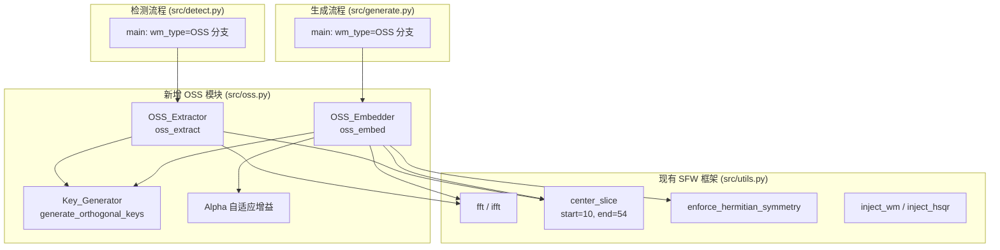
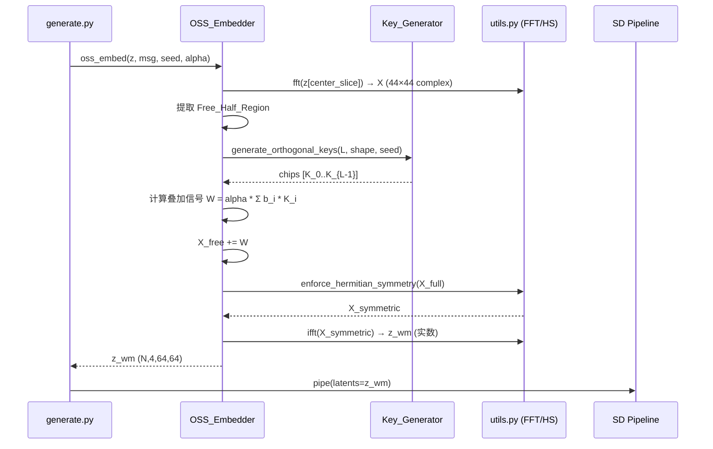

# 正交扩频多比特水印 (OSS) 技术设计文档

## 概述

本设计文档描述如何将正交扩频多比特水印 (Orthogonal Spread Spectrum, OSS) 集成到现有 SFW (Symmetric Fourier Watermarking) 框架中。OSS 水印通过在频域 Free Half-Region 中叠加正交码片来编码多比特消息，复用 SFW 已有的 FFT/IFFT、center-aware 嵌入和 Hermitian 对称填充机制。

### 核心设计思路

现有 SFW 框架（Tree-Ring、RingID、HSTR、HSQR）采用**模式替换**策略——将频域特定区域的系数替换为预定义的水印模式。OSS 采用不同的策略：**加性叠加**——在原始频域系数上叠加正交码片的线性组合，保留原始信号的大部分信息。

这一设计选择带来两个关键优势：
1. 可在单个潜在变量中编码任意长度的比特流（受限于嵌入区域维度）
2. 水印对潜在变量统计分布的影响可通过 alpha 参数精确控制

### 与现有框架的关系

OSS 作为新的 `wm_type="OSS"` 选项集成，遵循与 HSTR/HSQR 相同的 center-aware 设计（使用 `center_slice` 定义的 44×44 中心区域），并复用 `enforce_hermitian_symmetry` 确保 IFFT 后输出纯实数。

## 架构

### 系统架构图



### 数据流



### 文件结构

| 文件 | 变更类型 | 说明 |
|------|----------|------|
| `src/oss.py` | **新增** | OSS 核心模块：Key_Generator、OSS_Embedder、OSS_Extractor |
| `src/utils.py` | **不修改** | 保持现有接口不变，OSS 通过 import 复用 |
| `src/generate.py` | **修改** | 添加 `wm_type="OSS"` 分支 |
| `src/detect.py` | **修改** | 添加 `wm_type="OSS"` 分支 |


## 组件与接口

### 1. Key_Generator — 正交码片生成器

**职责：** 生成一组可复现的正交复数码片，用于多比特信息的扩频编码。

**设计决策：** 使用 `torch.manual_seed` 控制随机数生成器，从标准复正态分布 CN(0,1) 中采样码片。当嵌入区域维度远大于比特数时（如 44×44×4 = 7744 维 vs 16~32 比特），随机向量在高维空间中自然近似正交，无需显式正交化（如 Gram-Schmidt）。这简化了实现并保持了与 SFW 框架中其他随机种子驱动模式生成方法的一致性。

```python
def generate_orthogonal_keys(
    num_bits: int,
    shape: tuple,       # Free_Half_Region 的形状，如 (4, 44, 22)
    seed: int
) -> list[torch.Tensor]:
    """
    生成 num_bits 个复数码片张量。
    
    参数:
        num_bits: 需要编码的比特数
        shape: 每个码片的形状 (C, H, W_half)，对应 Free_Half_Region
        seed: 随机种子，确保可复现性
    
    返回:
        chips: 长度为 num_bits 的列表，每个元素为 shape 形状的 complex64 张量
    
    异常:
        ValueError: 当 num_bits 超过嵌入区域维度时
    """
```

**正交性保证：**
- 嵌入区域维度 D = C × H × W_half（对于 center_slice 44×44 区域，Free half 约为 4 × 44 × 22 = 3872）
- 当 num_bits << D 时，随机复正态向量的归一化内积绝对值 ≈ 1/√D ≈ 0.016
- 最大支持比特数限制为 D // 2（保守估计），超出时抛出 ValueError

### 2. OSS_Embedder — 水印嵌入器

**职责：** 将多比特消息编码为频域叠加信号并注入潜在变量。

**设计决策：** 遵循 HSTR 的 center-aware 模式——仅操作 `center_slice` 定义的 44×44 中心区域。在该区域的频域表示中，仅修改 Free_Half_Region（右半部分 + Nyquist 轴/DC 点的独立部分），然后通过 `enforce_hermitian_symmetry` 自动填充 Restricted_Half_Region。

```python
def oss_embed(
    z: torch.Tensor,           # (N, 4, 64, 64) 实数潜在变量
    msg: list[int],            # 长度为 L 的二进制列表 [0/1, ...]
    seed: int,                 # 码片生成种子
    alpha: float = None,       # 嵌入强度，None 表示自适应模式
    alpha_scale: float = 0.5,  # 自适应模式下的缩放因子
    debug: bool = False        # 调试模式
) -> torch.Tensor:
    """
    返回: z_wm (N, 4, 64, 64) 实数水印潜在变量
    """
```

**Free_Half_Region 定义：**

在 fftshift 后的 44×44 频谱中，Hermitian 对称性要求 `X[i,j] = conj(X[H-i, W-j])`（索引取模）。Free_Half_Region 定义为频谱的"右半部分"（列索引 > W//2），即 `[:, :, :, W//2+1:]`，形状为 `(N, 4, 44, 21)`。这与 `enforce_hermitian_symmetry` 的实现一致——该函数以右半/下半象限为"源"，自动推导左半/上半象限的共轭值。

**嵌入流程：**

1. 提取中心区域：`z_center = z[center_slice]`，形状 (N, 4, 44, 44)
2. FFT：`X = fft(z_center)`，形状 (N, 4, 44, 44) complex64
3. 提取 Free_Half_Region：`X_free = X[:, :, :, 23:]`，形状 (N, 4, 44, 21)
4. 生成码片：`chips = generate_orthogonal_keys(L, (4, 44, 21), seed)`
5. 比特映射：`b_i = 2 * msg[i] - 1`（{0,1} → {-1, +1}）
6. 计算 alpha（若自适应）：`alpha = alpha_scale * X_free.std()`
7. 叠加：`X_free_new = X_free + alpha * Σ(b_i * K_i)`
8. 回写 Free_Half_Region 到完整频谱
9. 调用 `enforce_hermitian_symmetry` 同步 Restricted_Half_Region
10. IFFT 并验证虚部：`z_wm_center = ifft(X_sym).real`
11. 回写中心区域：`z_wm[center_slice] = z_wm_center`

### 3. OSS_Extractor — 水印提取器

**职责：** 从潜在变量的频域表示中通过相关性检测恢复比特信息。

```python
def oss_extract(
    z_hat: torch.Tensor,       # (N, 4, 64, 64) 实数潜在变量
    seed: int,                 # 码片生成种子（与嵌入时相同）
    num_bits: int,             # 嵌入的比特数
    debug: bool = False        # 调试模式
) -> list[int]:
    """
    返回: 提取的比特列表，长度为 num_bits
    """
```

**提取流程：**

1. 提取中心区域并 FFT：`X_hat = fft(z_hat[center_slice])`
2. 提取 Free_Half_Region：`X_hat_free = X_hat[:, :, :, 23:]`
3. 均值归一化：`X_hat_free -= X_hat_free.mean()`（消除直流偏置）
4. 重新生成码片：`chips = generate_orthogonal_keys(num_bits, (4, 44, 21), seed)`
5. 对每个码片计算相关性：`corr_i = Re(⟨X_hat_free, K_i⟩)` = `Re(Σ X_hat_free * conj(K_i))`
6. 比特判定：`bit_i = 1 if corr_i > 0 else 0`

### 4. Alpha 自适应增益

**设计决策：** 提供两种模式以满足不同场景需求。

| 模式 | 触发条件 | 计算方式 | 适用场景 |
|------|----------|----------|----------|
| 固定模式 | `alpha` 参数为具体数值 | 直接使用传入值 | 精确控制、实验对比 |
| 自适应模式 | `alpha=None` | `alpha = alpha_scale * std(X_free)` | 默认推荐，自动适配不同潜在变量 |

自适应模式的原理：水印信号能量与载体信号能量成正比，使得 SNR（信噪比）在不同潜在变量间保持一致。`alpha_scale` 默认值 0.5 基于经验设定，可通过参数调整。

### 5. 调试与诊断

通过 `debug=True` 参数启用，输出以下信息：

**嵌入阶段：**
- 叠加前 `X_free` 的均值和标准差
- 叠加后 `X_free_new` 的均值和标准差
- 使用的 alpha 值
- IFFT 后虚部最大绝对值

**提取阶段：**
- 每个比特对应的相关性原始数值 `corr_i`
- 均值归一化前后的频域统计信息

### 6. 与 generate.py / detect.py 的集成

**generate.py 修改：**

在 `wm_type` 选择分支中添加 `"OSS"` 选项：

```python
elif args.wm_type == "OSS":
    from oss import oss_embed
    # OSS 不需要预生成 pattern_list，直接在嵌入时生成码片
    # 每个图像使用不同的 msg（由 identify_gt_indices 映射）
```

OSS 与现有方法的关键区别：现有方法（Tree-Ring 等）预生成 `wm_capacity` 个模式并通过 L1 距离匹配进行识别。OSS 直接编码比特流，识别通过比特流内容匹配实现，无需遍历所有候选模式。

**detect.py 修改：**

```python
elif args.wm_type == "OSS":
    from oss import oss_extract
    # DDIM Inversion 后直接调用 oss_extract
    # 输出 BER 而非 L1 距离
```


## 数据模型

### 核心数据结构

| 名称 | 类型 | 形状 | 说明 |
|------|------|------|------|
| `z` | `torch.Tensor` (float32) | (N, 4, 64, 64) | 原始潜在变量 |
| `z_wm` | `torch.Tensor` (float32) | (N, 4, 64, 64) | 水印潜在变量 |
| `z_center` | `torch.Tensor` (float32) | (N, 4, 44, 44) | center_slice 提取的中心区域 |
| `X` | `torch.Tensor` (complex64) | (N, 4, 44, 44) | 中心区域的 FFT 频域表示 |
| `X_free` | `torch.Tensor` (complex64) | (N, 4, 44, 21) | Free_Half_Region 频域系数 |
| `chip` | `torch.Tensor` (complex64) | (4, 44, 21) | 单个正交码片 |
| `msg` | `list[int]` | (L,) | 二进制消息 {0, 1} |
| `bipolar` | `list[int]` | (L,) | 双极性符号 {-1, +1} |
| `alpha` | `float` | 标量 | 嵌入强度参数 |
| `corr` | `list[float]` | (L,) | 每个比特的相关性值 |

### Free_Half_Region 索引定义

基于 `enforce_hermitian_symmetry` 的实现分析，对于 44×44 (偶数) 的 fftshift 频谱：

```
H, W = 44, 44
center = (H//2, W//2) = (22, 22)

Free_Half_Region = X[:, :, :, W//2+1:]   # 列 23..43，共 21 列
                                           # 形状: (N, 4, 44, 21)

Restricted_Half_Region = 由 enforce_hermitian_symmetry 自动推导
特殊点（DC、Nyquist）= 仅保留实部
```

这与 `enforce_hermitian_symmetry` 中的逻辑一致：
- 右半象限 `[:, :, H//2+1:, W//2+1:]` 为源 → 左上象限 `[:, :, 1:H//2, 1:W//2]` 为共轭翻转
- 左下象限 `[:, :, 1:H//2, W//2+1:]` 为源 → 右上象限 `[:, :, H//2+1:, 1:W//2]` 为共轭翻转
- Nyquist 轴右半为源 → 左半为共轭翻转

### 参数配置

| 参数 | 默认值 | 范围 | 说明 |
|------|--------|------|------|
| `num_bits` | 16 | 1 ~ D//2 | 嵌入比特数，D = 4×44×21 = 3696 |
| `seed` | 42 | 任意整数 | 码片生成种子 |
| `alpha` | None (自适应) | > 0 | 嵌入强度 |
| `alpha_scale` | 0.5 | (0, 2) | 自适应模式缩放因子 |
| `debug` | False | bool | 调试输出开关 |


## 正确性属性

*正确性属性是在系统所有有效执行中都应成立的特征或行为——本质上是关于系统应该做什么的形式化陈述。属性是人类可读规范与机器可验证正确性保证之间的桥梁。*

### Property 1: 码片生成的种子可复现性

*For any* 种子值 `seed`、比特数 `num_bits` 和形状 `shape`，使用相同参数两次调用 `generate_orthogonal_keys` 应产生完全相同的码片序列（逐元素相等）。

**Validates: Requirements 2.2**

### Property 2: 码片形状与分布正确性

*For any* 有效的 `num_bits`、`shape` 和 `seed`，生成的每个码片张量形状应与指定的 `shape` 完全匹配，且实部和虚部的均值应接近 0、标准差应接近 1（在统计误差范围内）。

**Validates: Requirements 2.3**

### Property 3: 码片正交性

*For any* 种子 `seed` 和 `num_bits`（≥2），生成的任意两个不同码片 K_i 和 K_j 的归一化内积绝对值 `|⟨K_i, K_j⟩| / (‖K_i‖ · ‖K_j‖)` 应小于 0.1。

**Validates: Requirements 2.4**

### Property 4: 嵌入后 Hermitian 对称性与纯实数输出

*For any* 有效的潜在变量 `z` 和比特消息 `msg`，经 OSS 嵌入后：(a) 中心区域频域表示满足 Hermitian 对称性 `X[i,j] ≈ conj(X[H-i, W-j])`；(b) IFFT 结果的虚部绝对值最大值小于 1e-5；(c) 输出张量为实数类型（float32）。

**Validates: Requirements 1.2, 3.6, 3.7, 7.1, 7.3**

### Property 5: Center-slice 区域隔离

*For any* 潜在变量 `z` 和比特消息 `msg`，嵌入后的水印潜在变量 `z_wm` 在 `center_slice` 区域之外的所有元素应与原始 `z` 完全相同。

**Validates: Requirements 3.8, 10.4**

### Property 6: 加性叠加公式正确性

*For any* 潜在变量 `z`、比特消息 `msg` 和固定 `alpha`，嵌入后 Free_Half_Region 中的频域系数应等于原始系数加上 `alpha * Σ(b_i * K_i)`，其中 `b_i` 为双极性符号，`K_i` 为对应码片。

**Validates: Requirements 3.5**

### Property 7: 嵌入-提取往返一致性

*For any* 有效的比特消息 `msg`（长度 1 到 64）和潜在变量 `z`，使用相同的 `seed` 和 `alpha` 进行嵌入后直接提取（无攻击），提取的比特流应与原始 `msg` 完全一致（BER = 0）。

**Validates: Requirements 8.1, 8.2, 8.3**

### Property 8: 提取输出长度不变量

*For any* `num_bits` 值和潜在变量 `z_hat`，`oss_extract` 的输出列表长度应恰好等于 `num_bits`。

**Validates: Requirements 5.6**

### Property 9: 均值归一化有效性

*For any* 潜在变量的 Free_Half_Region 频域系数，经均值归一化后的张量均值绝对值应小于 1e-6。

**Validates: Requirements 5.3**

### Property 10: 水印对统计分布的影响控制

*For any* 潜在变量 `z` 和使用默认 `alpha` 参数嵌入的水印潜在变量 `z_wm`：(a) 均值差异 `|mean(z_wm) - mean(z)|` 应小于 0.1；(b) 标准差比值 `std(z_wm) / std(z)` 应在 [0.8, 1.2] 范围内。

**Validates: Requirements 9.1, 9.2**

### Property 11: 自适应 Alpha 计算正确性

*For any* 潜在变量 `z` 和 `alpha_scale` 值，自适应模式下计算的 `alpha` 应等于 `alpha_scale * std(X_free)`，其中 `X_free` 为中心区域 Free_Half_Region 的频域系数。

**Validates: Requirements 4.2**


## 错误处理

| 场景 | 处理方式 | 说明 |
|------|----------|------|
| `num_bits` 超过嵌入区域维度上限 | 抛出 `ValueError`，包含描述性错误信息 | 上限 = D // 2，D = C × H × W_half |
| `msg` 长度与 `num_bits` 不匹配 | 抛出 `ValueError` | 嵌入时检查 |
| `msg` 包含非 {0, 1} 值 | 抛出 `ValueError` | 嵌入时检查 |
| IFFT 虚部最大值 ≥ 1e-5 | 记录 `warnings.warn` 警告，报告虚部最大绝对值 | 不中断执行，仍取实部输出 |
| `alpha` ≤ 0 | 抛出 `ValueError` | 固定模式下检查 |
| `z` 形状不为 4D 张量 | 抛出 `ValueError` | 输入验证 |
| 自适应 alpha 计算结果为 0（频域系数全零） | 回退到默认固定值 `alpha = 0.5` | 极端边界情况 |

## 测试策略

### 双重测试方法

本特性采用单元测试与属性测试相结合的策略：

- **单元测试**：验证特定示例、边界情况和错误条件
- **属性测试**：验证在所有有效输入上成立的通用属性

### 属性测试配置

- **测试库**：`hypothesis`（Python 属性测试库）
- **每个属性测试最少运行 100 次迭代**
- **每个属性测试必须通过注释引用设计文档中的属性编号**
- **标签格式**：`# Feature: orthogonal-spread-spectrum-watermark, Property {number}: {property_text}`
- **每个正确性属性由单个属性测试实现**

### 属性测试覆盖

| 属性编号 | 属性名称 | 测试策略 | 生成器 |
|----------|----------|----------|--------|
| P1 | 种子可复现性 | 生成随机 seed，两次调用比较 | `st.integers(0, 2**31)` |
| P2 | 码片形状与分布 | 生成随机参数，检查形状和统计量 | `st.integers(1, 64)`, `st.integers(0, 2**31)` |
| P3 | 码片正交性 | 生成随机参数，计算所有码片对的内积 | `st.integers(2, 32)`, `st.integers(0, 2**31)` |
| P4 | Hermitian 对称性 | 生成随机潜在变量和消息，验证对称性 | `st.lists(st.integers(0,1))`, 随机 float 张量 |
| P5 | Center-slice 隔离 | 生成随机潜在变量，比较嵌入前后非中心区域 | 随机 float 张量 |
| P6 | 加性叠加公式 | 生成随机输入，代数验证 | 随机张量 + 随机消息 |
| P7 | 往返一致性 | 生成随机消息，嵌入后提取比较 | `st.lists(st.integers(0,1), min_size=1, max_size=64)` |
| P8 | 输出长度不变量 | 生成随机 num_bits，检查输出长度 | `st.integers(1, 64)` |
| P9 | 均值归一化 | 生成随机复数张量，归一化后检查均值 | 随机 complex 张量 |
| P10 | 统计分布影响 | 生成随机潜在变量和消息，检查均值/标准差 | 随机 float 张量 |
| P11 | 自适应 Alpha | 生成随机潜在变量，验证 alpha 计算 | 随机 float 张量 + `st.floats(0.1, 2.0)` |

### 单元测试覆盖

| 测试场景 | 类型 | 说明 |
|----------|------|------|
| `num_bits` 超限错误 | 边界/错误 | 验证 ValueError 抛出和错误信息 |
| `msg` 包含非法值 | 错误 | 验证输入验证 |
| `center_slice` 定义不变 | 示例 | 验证 start=10, end=54 |
| `wm_type="OSS"` 参数支持 | 集成 | 验证 CLI 参数解析 |
| 固定 vs 自适应 Alpha 模式 | 示例 | 验证两种模式均可工作 |
| 调试模式输出 | 示例 | 验证 debug=True 不抛出异常 |
| 16 比特和 32 比特具体示例 | 示例 | 需求 8.1、8.2 的具体验证 |

